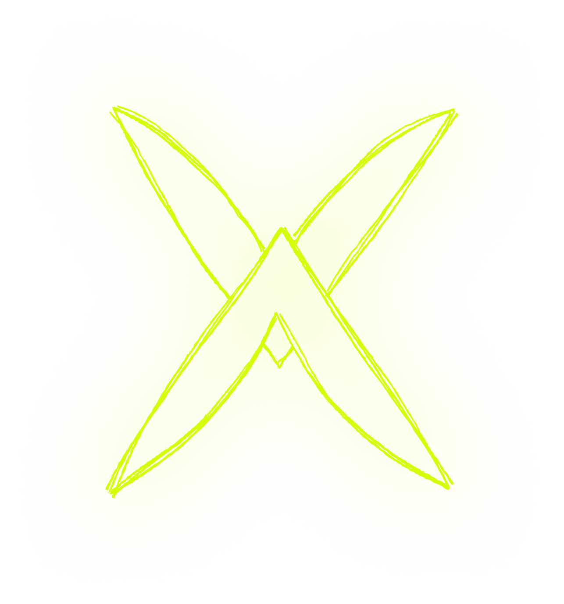
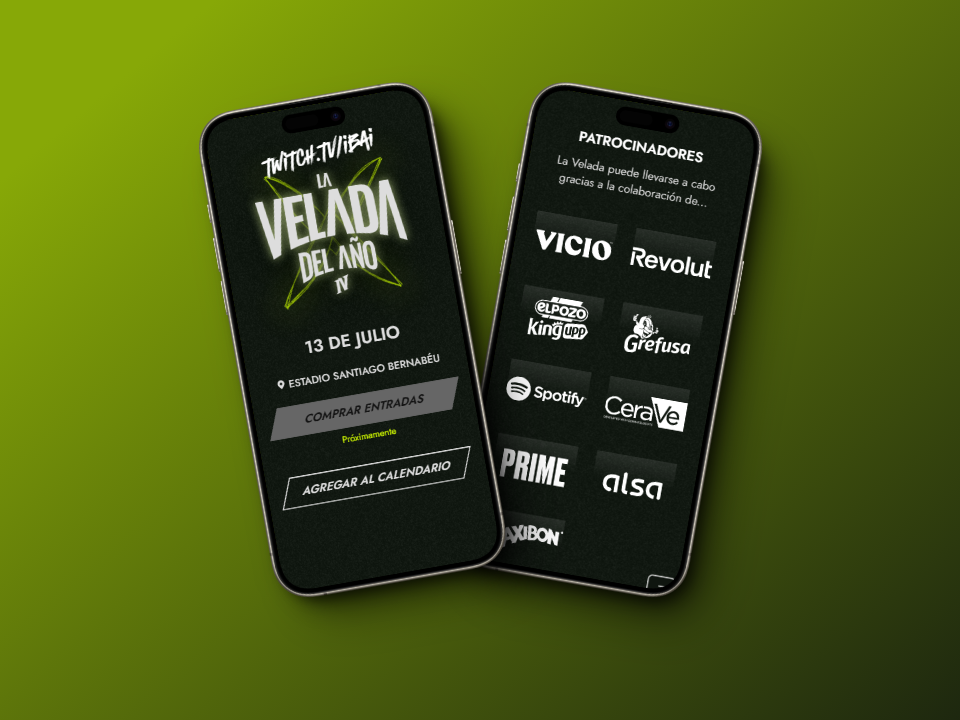
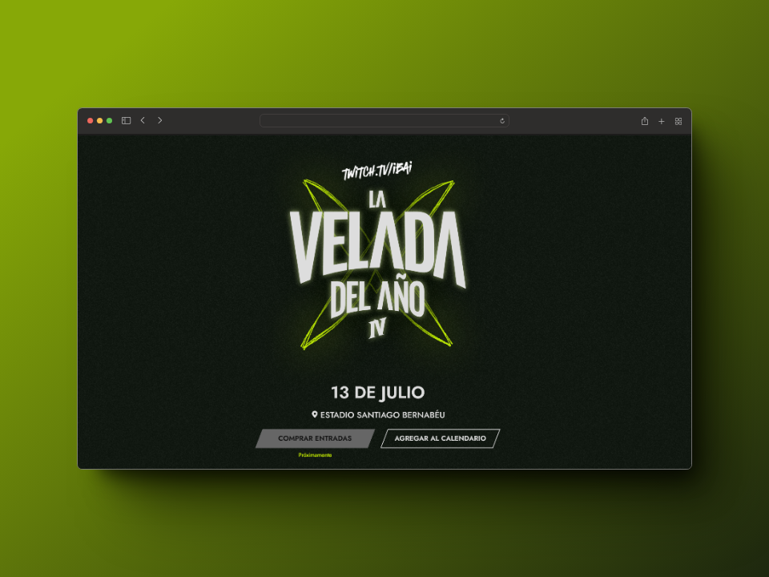

	     
   ## [DEMO](https://velada-iv.vercel.app/?boxer=alana)

## Clon de la pagina web de la Velada 4

La Velada IV es una competición de boxeo que enfrenta a streamers, creadores de contenido y otras celebridades sobre un ring.\
[Diseño de Figma](https://www.figma.com/file/7uUHCJ7YhJEoB24EZ00lXC/240405-LVDA-IV?type=design&node-id=0-1&mode=design&t=CUK9cH8DXhKXx31U-0) ·

Tabla de contenidos

- [Web oficial de La Velada IV](#web-oficial-de-la-velada-iv)
- [Características principales](#características-principales)
  - [Capturas de pantalla de la web de La Velada IV:](#capturas-de-pantalla-de-la-web-de-la-velada-iv)
- [Para empezar](#para-empezar)
  - [Prerequisitos](#prerequisitos)
  - [Instalación](#instalación)
- [Contribuir al proyecto](#contribuir-al-proyecto)
  - [Contribuir desde Stackblitz](#contribuir-desde-stackblitz)
- [🛠️ Stack](#️-stack)

## Características principales

- **Detalles del evento**: Obtén información detallada sobre la fecha, hora, ubicación y artistas participantes.
- **Compra de boletos**: Permite a los usuarios dirigirlos a la compra de boletos fácilmente.
- **Redes sociales**: Conoce las redes oficiales donde podrás informarte sobre el evento.

### Capturas de pantalla de la web de La Velada IV

(<a href="#readme-top">volver arriba</a>)

